# Learn Kubernetes

prequistist
virtualbox

chmode +x install-docker-kube.sh
Tại thư mục kubernetes-centos7/master/ gõ lệnh vagrant để tạo máy master.xtl
vagrant up

Gõ lệnh sau để khở tạo là nút master của Cluster
kubeadm init --apiserver-advertise-address=172.16.10.100 --pod-network-cidr=192.168.0.0/16

Sau khi lệnh chạy xong, chạy tiếp cụm lệnh nó yêu cầu chạy sau khi khởi tạo- để chép file cấu hình đảm bảo trình kubectl trên máy này kết nối Cluster
mkdir -p $HOME/.kube
sudo cp -i /etc/kubernetes/admin.conf $HOME/.kube/config
sudo chown $(id -u):$(id -g) $HOME/.kube/config

Tiếp đó, nó yêu cầu cài đặt một Plugin mạng trong các Plugin tại addon, ở đây đã chọn calico, nên chạy lệnh sau để cài nó
kubectl create -f https://raw.githubusercontent.com/projectcalico/calico/v3.25.1/manifests/tigera-operator.yaml
kubectl create -f https://raw.githubusercontent.com/projectcalico/calico/v3.25.1/manifests/custom-resources.yaml

Cấu hình kubectl máy trạm truy cập đến các Cluster
để xem nội dung cấu hình kubectl gõ lệnh
kubectl config view

Giờ bạn sẽ thực hiện kết hợp 2 file: config và config-mycluster thành 1 và lưu trở lại config.
export KUBECONFIG=~/.kube/config:~/.kube/config-mycluster-1
kubectl config view --flatten > ~/.kube/config_temp
mv ~/.kube/config_temp ~/.kube/config

# Các ngữ cảnh hiện có trong config
kubectl config get-contexts

Ký hiệu * là cho biết context hiện tại, nếu muốn chuyển làm việc sang context có tên kubernetes-admin@kubernetes (nối với cluster mới tạo ở trên) thì gõ lệnh
kubectl config use-context kubernetes-admin@kubernetes

Kết nối Node vào Cluster
kubeadm token create --print-join-command

# node worker kết nối vào Cluster
kubeadm join 172.16.10.100:6443 --token 5ajhhs.atikwelbpr0 ...

# Lấy thông tin Cluster
kubectl cluster-info

# Các Node có trong Cluster
kubectl get nodes
kubectl get node -o wide

# Muốn lấy manifest mô tả thông tin tài nguyên
kubectl get node -o yaml
kubectl get pod/ungdung1 -o yaml

# Các pod đang chạy trong tất cả các namespace
kubectl get pods -A

# describe node
kubectl describe node/worker1.kube.node
node master thì có lable là: node-role.kubernetes.io/master=

# gán nhãn cho 1 node:
kubectl label node worker.kube.node nodeabc=ungdungpython
lấy ra node có 1 nhãn mà mình chỉ định:
kubectl get node -l "nodeabc=ungdungpython"
xóa 1 label: kubectl label node worker1.kube.node nodeabc-

# Create dashboard
Do cấu hình mặc định của Kubernetes Cluster, cổng được mở ra ngoài phải chọn trong khoảng 30000-32767 sau này bạn có thể sửa cấu hình này với tham số chạy Cluster --service-node-portrange

# apply dashboard
kubectl apply -f dashboard.yaml

# check pod trong namespace
kubectl get pod -n kubernetes-dashboard

Tạo kubernetes-dashboard-certs, xác thực SSL
Ta sẽ dùng OpenSSL để sinh certificates tự xác thực SSL (ngoài ra khi triển khai thực tế có thể lấy các certificate do mua hoặc miễn phí từ https://letsencrypt.org/ theo Domain), chạy các lệnh sau:
sudo mkdir certs
sudo chmod 777 -R certs
openssl req -nodes -newkey rsa:2048 -keyout certs/dashboard.key -out certs/dashboard.csr -subj "/C=/ST=/L=/O=/OU=/CN=kubernetes-dashboard"
openssl x509 -req -sha256 -days 365 -in certs/dashboard.csr -signkey certs/dashboard.key -out certs/dashboard.crt
sudo chmod -R 777 certs

Trên Windows nếu không có lệnh openssl có thể tạo một Image có cài OpenSSL ví dụ Dockerfile sau:
FROM alpine

RUN apk update && \
  apk add --no-cache openssl && \
  rm -rf /var/cache/apk/*

WORKDIR /

ENTRYPOINT ["openssl"]

Build image đặt tên ví dụ, myopenssl
docker build -t myopenssl -f Dockerfile .

Sau đó phát sinh cert trên Windows
mkdir certs
docker run --rm -v ${PWD}/certs:/certs/ myopenssl req -nodes -newkey rsa:2048 -keyout /certs/dashboard.key -out /certs/dashboard.csr -subj "/C=/ST=/L=/O=/OU=/CN=kubernetes-dashboard"
docker run --rm -v ${PWD}/certs:/certs/ myopenssl x509 -req -sha256 -days 365 -in /certs/dashboard.csr -signkey /certs/dashboard.key -out /certs/dashboard.crt

Sau khi hoàn thành thì các thông tin certificate lưu ở thư mục certs, chạy lệnh sau để tạo Secret
kubectl create secret generic kubernetes-dashboard-certs --from-file=certs -n kubernetes-dashboard

xem secret kubernetes-dashboard
kubectl get secret -n kubernetes-dashboard
kubectl describe secret kubernetes-dashboard-certs -n kubernetes-dashboard

Giờ truy cập địa chỉ https://192.168.10.100:31000 sẽ vào màn hình đăng nhập

Sau đó chạy lệnh:
kubectl apply -f admin-user.yaml

Tiếp theo chạy lệnh sau để lấy Token
kubectl get secret -n kubernetes-dashboard 
kubectl describe secret/admin-user-token -n kubernetes-dashboard

Copy toàn bộ đoạn Token để đưa vào đăng nhập

# với docker desktop
kubectl apply -f https://raw.githubusercontent.com/kubernetes/dashboard/v2.7.0/aio/deploy/recommended.yaml 
kubectl proxy
kubectl apply -f create-service-cccount.yaml
kubectl apply -f create-cluster-role-binding.yaml
kubectl -n kubernetes-dashboard create token admin-user


các lệnh pod
kubectl get pods	Liệt kê các POD trong namespace hiện tại, thêm tham số -o wide hiện thị chi tiết hơn, thêm -A hiện thị tất cả namespace, thêm -n namespacename hiện thị Pod của namespace namespacename
kubectl explain pod --recursive=true	Xem cấu trúc mẫu định nghĩa POD trong file cấu hình yaml
kubectl apply -f firstpod.yaml	Triển khai tạo các tài nguyên định nghĩa trong file firstpod.yaml
kubectl delete -f firstpod.yaml	Xóa các tài nguyên tạo ra từ định nghĩa firstpod.yaml
kubectl describe pod/namepod	Lấy thông tin chi tiết POD có tên namepod, nếu POD trong namespace khác mặc định thêm vào tham số -n namespace-name
kubectl logs pod/podname	Xem logs của POD có tên podname

kubectl exec mypod command
Chạy lệnh từ container của POD có tên mypod, nếu POD có nhiều container thêm vào tham số -c và tên container, mặc định sẽ vào container thứ 1
vd: kubectl exec ungdung1 ls /
    kubectl exec -it tools bash

kubectl exec -it mypod bash	Chạy lệnh bash của container trong POD mypod và gắn terminal
kubectl proxy	Tạo server proxy truy cập đến các tài nguyên của Cluster. http://localhost/api/v1/namespaces/default/pods/mypod:8085/proxy/, truy cập đến container có tên mypod trong namespace mặc định.
kubectl delete pod/mypod	Xóa POD có tên mypod

Triển khai tạo Pod từ file này, thực hiện lệnh sau
kubectl apply -f 1-swarmtest-node.yaml
kubectl apply -f 2-nginx.yaml
kubectl apply -f 3-tools.yaml
kubectl apply -f 4-nginx-swamtest.yaml
kubectl apply -f 5-nginx-swamtest-vol.yaml
kubectl delete -f example/pods (delete all pod)

Mặc định Kubernetes không tạo và chạy POD ở Node Master để đảm bảo yêu cầu an toàn, nếu vẫn muốn chạy POD ở Master thi hành lệnh sau:
kubectl taint nodes --all node-role.kubernetes.io/master-

# xem các sự kiện xảy ra trong cluster
kubectl get event/ev

# chỉnh sửa nôi dung của file manifest của pod:
kubectl edit po/ungdung1 

Truy cập Pod từ bên ngoài Cluster (Kiểm tra - Debug)
Trong thông tin của Pod ta thấy có IP của Pod và cổng lắng nghe, tuy nhiên Ip này là nội bộ, chỉ các Pod trong Cluster liên lạc với nhau. Nếu bên ngoài muốn truy cập cần tạo một Service để chuyển traffic bên ngoài vào Pod (tìm hiểu sau), tại đây để debug - truy cập kiểm tra bằng cách chạy proxy:
kubectl proxy
Hoặc
kubectl proxy --address="0.0.0.0" --accept-hosts='^*$'
Truy cập đến địa chỉ http://localhost/api/v1/namespaces/default/pods/mypod:8085/proxy/
Khi kiểm tra chạy thử, cũng có thể chuyển cổng để truy cập. Ví dụ cổng host 8080 được chuyển hướng truy cập đến cổng 8085 của POD mypod
kubectl port-forward mypod 8080:8085

Ổ đĩa / Volume trong POD
Để thêm các Volume đầu tiên cần định nghĩa ổ đĩa ở trường spec.volumes. Tại mỗi container gắn ổ đĩa vào nếu cần với thuộc tính volumeMounts
Nếu muốn sử dụng ổ đĩa - giống nhau về dữ liệu trên nhiều POD, kể cả các POD đó chạy trên các máy khác nhau thì cần dùng các loại đĩa Remote - ví dụ NFS

Cấu hình thăm dò Container còn sống
Bạn có thể cấu hình livenessProbe cho mỗi container, để Kubernetes kiểm tra xem container còn sống không. Ví dụ, đường dẫn kiểm tra là /healthycheck, nếu nó trả về mã header trong khoảng 200 đến 400 được coi là sống (tất nhiên bạn cần viết ứng dụng trả về mã này). Trong đó cứ 10s kiểm tra một lần
```yaml
apiVersion: v1
kind: Pod
metadata:
  name: mypod
  labels:
    app: mypod
spec:
  containers:
  - name: mycontainer
    image: ichte/swarmtest:php
    ports:
    - containerPort: 8085
    resources: {}

    livenessProbe:
      httpGet:
        path: /healthycheck
        port: 8085
      initialDelaySeconds: 10
      periodSeconds: 10
```

ReplicaSet là một điều khiển Controller - nó đảm bảo ổn định các nhân bản (số lượng và tình trạng của POD, replica) khi đang chạy.
Khi định nghĩa một ReplicaSet (định nghĩa trong file .yaml) gồm các trường thông tin, gồm có trường selector để chọn ra các các Pod theo label, từ đó nó biết được các Pod nó cần quản lý(số lượng POD có đủ, tình trạng các POD). Trong nó nó cũng định nghĩa dữ liệu về Pod trong spec template, để nếu cần tạo Pod mới nó sẽ tạo từ template đó. Khi ReplicaSet tạo, chạy, cập nhật nó sẽ thực hiện tạo / xóa POD với số lượng cần thiết trong khai báo (repilcas).

# Launch các replicaSet
kubectl apply -f 1.rs.yaml

Cấu hình trong ReplicaSet/1.app.yaml định nghĩa một ReplicaSet đặt tên là rsapp, nó quản lý nhân bản 3 POD có nhãn app=rsapp, POD có một container từ image ichte/swarmtest:node
Để lấy các ReplicaSet thực hiện lệnh
kubectl get rs

Thông tin về ReplicaSet có tên rsapp
kubectl describe rs/rsapp
xuất manifest của replicaset
kubectl get rs -o yaml

# monitor component tạo ra every 1s:
watch -n 1 kubectl get all -o wide

Horizontal Pod Autoscaler là chế độ tự động scale (nhân bản POD) dựa vào mức độ hoạt động của CPU đối với POD, nếu một POD quá tải - nó có thể nhân bản thêm POD khác và ngược lại - số nhân bản dao động trong khoảng min, max cấu hình

Ví dụ, với ReplicaSet rsapp trên đang thực hiện nhân bản có định 3 POD (replicas), nếu muốn có thể tạo ra một HPA để tự động scale (tăng giảm POD) theo mức độ đang làm việc CPU, có thể dùng lệnh sau:

kubectl autoscale rs rsapp --max=2 --min=1
Lệnh trên tạo ra một hpa có tên rsapp, có dùng tham chiếu đến ReplicaSet có tên rsapp để scale các POD với thiết lập min, max các POD

Để liệt kê các hpa gõ lệnh
kubectl get hpa -o wide

Để linh loạt và quy chuẩn, nên tạo ra HPA (HorizontalPodAutoscaler) từ cấu hình file yaml
kubectl apply -f 2.hpa.yaml

Deployment quản lý một nhóm các Pod - các Pod được nhân bản, nó tự động thay thế các Pod bị lỗi, không phản hồi bằng pod mới nó tạo ra. Như vậy, deployment đảm bảo ứng dụng của bạn có một (hay nhiều) Pod để phục vụ các yêu cầu.
Apply deployment:
kubectl apply -f 1.myapp-deploy.yaml

kiểm tra deployment:
kubectl get deploy -o wide

Deploy này quản sinh ra một ReplicasSet và quản lý nó, gõ lệnh sau để hiện thị các ReplicaSet
kubectl get rs -o wide

Edit deploy app:
kubectl edit deploy/deployapp

Có thể thu hồi lại bản cập nhật bằng cách sử dụng lệnh 
kubectl rollout undo

Cập nhật image mới trong POD - ví dụ thay image của container node bằng image mới httpd

kubectl set image deploy/deployapp node=httpd --record
Để xem quá trình cập nhật của deployment

kubectl rollout status deploy/deployapp
Khi cập nhật, ReplicaSet cũ sẽ hủy và ReplicaSet mới của Deployment được tạo, tuy nhiên ReplicaSet cũ chưa bị xóa để có thể khôi phục lại về trạng thái trước (rollback).

Bạn cũng có thể cập nhật tài nguyên POD theo cách tương tự, ví dụ giới hạn CPU, Memory cho container với tên app-node

kubectl set resources deploy/deployapp -c=node --limits=cpu=200m,memory=200Mi

Kiểm tra các lần cập nhật (revision)

kubectl rollout history deploy/deployapp

Để xem thông tin bản cập nhật 1 thì gõ lệnh

kubectl rollout history deploy/deployapp --revision=1
Khi cần quay lại phiên bản cũ nào đó, ví dụ bản revision 1

kubectl rollout undo deploy/deployapp --to-revision=1
Nếu muốn quay lại bản cập nhật trước gần nhất

kubectl rollout undo deploy/mydeploy

Scale thay đổi chỉ số replica (số lượng POD) của Deployment, ý nghĩa tương tự như scale đối với ReplicaSet trong phần trước. Ví dụ để scale với 10 POD thực hiện lệnh:

kubectl scale deploy/deployapp --replicas=10
Muốn thiết lập scale tự động với số lượng POD trong khoảng min, max và thực hiện scale khi CPU của POD hoạt động ở mức 50% thì thực hiện

kubectl autoscale deploy/deployapp --min=2 --max=5 --cpu-percent=50
Bạn cũng có thể triển khai Scale từ khai báo trong một yaml. Hoặc có thể trích xuất scale ra để chỉnh sửa

kubectl get hpa/deployapp -o yaml > 2.hpa.yaml

Các POD được quản lý trong Kubernetes, trong vòng đời của nó chỉ diễn ra theo hướng - được tạo ra, chạy và khi nó kết thúc thì bị xóa và khởi tạo POD mới thay thế. ! Có nghĩa ta không thể có tạm dừng POD, chạy lại POD đang dừng ...

Mặc dù mỗi POD khi tạo ra nó có một IP để liên lạc, tuy nhiên vấn đề là mỗi khi POD thay thế thì là một IP khác, nên các dịch vụ truy cập không biết IP mới nếu ta cấu hình nó truy cập đến POD nào đó cố định. Để giải quết vấn đề này sẽ cần đến Service.

Service (micro-service) là một đối tượng trừu tượng nó xác định ra một nhóm các POD và chính sách để truy cập đến POD đó. Nhóm cá POD mà Service xác định thường dùng kỹ thuật Selector (chọn các POD thuộc về Service theo label của POD). Cũng có thể hiểu Service là một dịch vụ mạng, tạo cơ chế cân bằng tải (load balancing) truy cập đến các điểm cuối (thường là các Pod) mà Service đó phục vụ.

apply service 
kubectl apply -f 1.svc1.yaml

File trên khai báo một service đặt tên svc1, kiểu của service là ClusterIP, đây là kiểu mặc định (ngoài ra còn có kiểu NodePort, LoadBalancer, ExternalName), phần khai báo cổng gồm có cổng của service (port) tương ứng ánh xạ vào cổng của endpoint (targetPort - thường là cổng Pod).

# lấy các service
kubectl get svc -o wide

# xem thông tin của service svc1
kubectl describe svc/svc1

kubeDNS: phân giải tên service thành các địa chỉ ip

Service trên có tên svc1, không có selector để xác định các Pod là endpoint của nó, nên có thể tự tạo ra một endpoint cùng tên svc1
kubectl apply -f 2.endpoint.yaml

```bash
kubectl describe svc/svc1

Name:              svc1
Namespace:         default
Labels:            <none>
Annotations:       kubectl.kubernetes.io/last-applied-configuration: ...
Selector:          <none>
Type:              ClusterIP
IP:                10.97.217.42
Port:              port1  80/TCP
TargetPort:        80/TCP
Endpoints:         216.58.220.195:80
Session Affinity:  None
Events:            <none>
```

Như vậy svc1 đã có endpoints, khi truy cập svc1:80 hoặc svc1.default:80 hoặc 10.97.217.42:80 có nghĩa là truy cập 216.58.220.195:80

list các endpoints:
kubectl get endpoints

Triển khai trên Cluster 2 POD chạy độc lập, các POD đó đều có nhãn app: app1
kubectl apply -f 3.pods.yaml
Nó tạo ra 2 POD myapp1 (192.168.41.147 chạy nginx) và myapp2 (192.168.182.11 chạy httpd), chúng đều có nhãn app=app1
Tiếp tục tạo ra service có tên svc2 có thêm thiết lập selector chọn nhãn app=app1
```bash
kubectl apply -f 4.svc2.yaml
kubectl describe svc/svc2
Name:              svc2
Namespace:         default
Labels:            <none>
Annotations:       kubectl.kubernetes.io/last-applied-configuration: ...
Selector:          app=app1
Type:              ClusterIP
IP:                10.100.165.105
Port:              port1  80/TCP
TargetPort:        80/TCP
Endpoints:         192.168.182.11:80,192.168.41.147:80
Session Affinity:  None
Events:            <none>
```

truy cập endpoint bằng:
kubectl exec -it tools bash (pods/3.tools.yaml)
curl svc2:80

NodePort tạo ra có thể truy cập từ ngoài internet bằng IP của các Node, ví dụ sửa dịch vụ svc2 trên thành dịch vụ svc3 kiểu NodePort:
kubectl appy -f 5.svc3.yaml
Trong file trên, thiết lập kiểu với type: NodePort, lúc này Service tạo ra có thể truy cập từ các IP của Node với một cổng nó ngẫu nhiên sinh ra trong khoảng 30000-32767. Nếu muốn ấn định một cổng của Service mà không để ngẫu nhiên thì dùng tham số nodePort như trên.Sau khi triển khai có thể truy cập với IP là địa chỉ IP của các Node và cổng là 31080, ví dụ 172.16.10.101:31080

# Ví dụ ứng dụng Service, Deployment, Secret
## 1. Xây dựng một image mới từ image cơ sở nginx rồi đưa lên registry Hub Docker đặt tên là ichte/swarmtest:nginx
thiết lập Service - svc\nginx\nginx.conf lắng nghe yêu cầu gửi đến cổng 80 và 443 (tương ứng với 2 server), thư mục gốc làm việc mặc định của chúng là /usr/share/nginx/html, tại đây sẽ copy và một file index.html
```bash
# build image từ Dockerfile, đặt tên image mới là ichte/swarmtest:nginx
docker build -t ichte/swarmtest:nginx -f Dockerfile .
# đẩy image lên hub docker
docker push ichte/swarmtest:nginx
```
## 2. Tạo Secret chứa xác thực SSL sử dụng bởi ichte/swarmtest:nginx
Xác thực SSL gồm có server certificate và private key, đối với nginx cấu hình qua hai thiết lập ssl_certificate và ssl_certificate_key tương ứng ta đã cấu hình là hai file tls.crt, tls.key. Ta để tên này vì theo cách đặt tên của letsencrypt.org, sau này bạn có thể thận tiện hơn nếu xin xác thực miễn phí từ đây.
Thực hiện lệnh sau để sinh file tự xác thực
```bash
openssl req -nodes -newkey rsa:2048 -keyout tls.key  -out ca.csr -subj "/CN=xuanthulab.net"
openssl x509 -req -sha256 -days 365 -in ca.csr -signkey tls.key -out tls.crt
```
Đến đây có 2 file tls.key và tls.crt
Thi hành lệnh sau để tạo ra một Secret (loại ổ đĩa chứa các thông tin nhạy cảm, nhỏ), Secret này kiểu tls, tức chứa xác thức SSL
```bash
kubectl create secret tls secret-nginx-cert --cert=certs/tls.crt  --key=certs/tls.key
```
Secret này tạo ra thì mặc định nó đặt tên file là tls.crt và tls.key có thể xem với lệnh:
kubectl describe secret/secret-nginx-cert

## 3. Tạo deployment chạy/quản lý các POD có chạy ichte/swarmtest:nginx
## 4. Tạo Service kiểu NodePort để truy cập đến các POD trên
kubectl apply -f example\Service - svc\6.nginx.yaml

Giờ có thể truy cập từ địa chỉ IP của Node với cổng tương ứng (Kubernetes Docker thì http://localhost:31080 và https://localhost:31443)

check outdated images
kubectl community-images | grep '❌'

Headless Service
Các Service trước bạn tạo nó có một địa chỉ IP riêng của Service, nó dùng cơ chế cân bằng tải để liên kết với các POD. Tuy nhiên nếu nuốn không dùng cơ chế cân bằng tải, mỗi lần truy cập tên Service nó truy cập thẳng tới IP của PO thì dùng loại Headless Service.
Một Headless Service (Service không IP) nó liên kết thẳng với IP của POD, có nghĩa bạn sẽ không tương tác trực tiếp với POD qua proxy. Tạo loại Service này giống như Service khác, chỉ việc thiết lập thêm .spec.clusterIP có giá trị None
kubectl apply -f 1-headless-svc.yaml
# ds service
kubectl get svc -o wide

triên khai một Deploy tạo POD có nhãn trên: app=test-app
kubectl apply -f 2-deploy-test-app.yaml

Bạn có thể vào một Container trong hệ thống Kubernetes, thức hiện lệnh ping đến Service headless (một lần trả về IP của POD chứ không có IP service như trước), hoặc dùng lệnh nslook để phân giải tên headless là những IP nào.
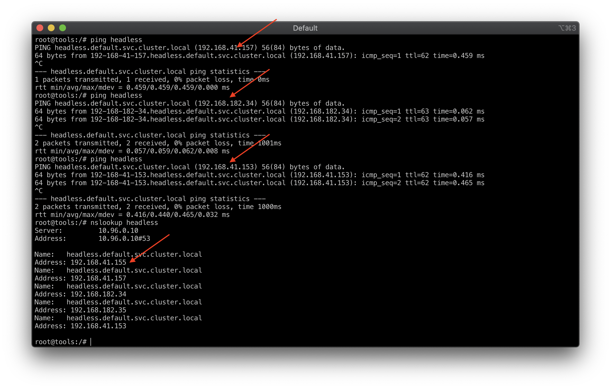

DaemonSet (ds) đảm bảo chạy trên mỗi NODE một bản copy của POD. Triển khai DaemonSet khi cần ở mỗi máy (Node) một POD, thường dùng cho các ứng dụng như thu thập log, tạo ổ đĩa trên mỗi Node

kubectl apply -f DeamonSet/1.ds.yaml

# Liệt kê các DaemonSet
kubectl get ds -o wide

# Liệt kê các POD theo nhãn
kubectl get pod -o wide -l "app=ds-nginx"

# Chi tiết về ds
kubectl describe ds/dsapp

# Xóa DaemonSet
kubectl delete ds/dsapp

Mặc định NODE master của kubernetes không cho triển khai chạy các POD trên nó để an toàn, nếu muốn cho phép tạo Pod trên node Master thì xóa đi taint có tên node-role.kubernetes.io/master
# xóa taint trên node master.xtl cho phép tạo Pod
kubectl taint node master.xtl node-role.kubernetes.io/master-

# thêm taint trên node master.xtl ngăn tạo Pod trên nó
kubectl taint nodes master.xtl node-role.kubernetes.io/master=false:NoSchedule

Job (jobs) có chức năng tạo các POD đảm bảo nó chạy và kết thúc thành công. Khi các POD do Job tạo ra chạy và kết thúc thành công thì Job đó hoàn thành. Khi bạn xóa Job thì các Pod nó tạo cũng xóa theo. Một Job có thể tạo các Pod chạy tuần tự hoặc song song. Sử dụng Job khi muốn thi hành một vài chức năng hoàn thành xong thì dừng lại (ví dụ backup, kiểm tra ...)

Khi Job tạo Pod, Pod chưa hoàn thành nếu Pod bị xóa, lỗi Node ... nó sẽ thực hiện tạo Pod khác để thi hành tác vụ.
kubectl apply -f 2.job.yaml

# Thông tin job có tên myjob
kubectl describe job/myjob

CronJob (cj) - chạy các Job theo một lịch định sẵn. Việc lên lịch cho CronJob khai báo giống Cron của Linux.

# Danh sách các CronJob
kubectl get cj -o wide

# Danh sách các Job
kubectl get jobs -o wide

PersistentVolume (pv) là một phần không gian lưu trữ dữ liệu trong cluster, các PersistentVolume giống với Volume bình thường tuy nhiên nó tồn tại độc lập với POD (pod bị xóa PV vẫn tồn tại), có nhiều loại PersistentVolume có thể triển khai như NFS, Clusterfs ...
PersistentVolumeClaim (pvc) là yêu cầu sử dụng không gian lưu trữ (sử dụng PV). Hình dung PV giống như Node, PVC giống như POD. POD chạy nó sử dụng các tài nguyên của NODE, PVC hoạt động nó sử dụng tài nguyên của PV.


# triển khai
kubectl apply -f 1.persistent-vol.yaml
watch kubectl get all,pv,pvc -o wide

# liệt kê các PV
kubectl get pv -o wide

# thông tin chi tiết
kubectl describe pv/pv1

# triển khai
kubectl apply -f 2.persistent-vol-claim.yaml

kubectl get pvc,pv -o wide
kubectl describe pvc/pvc1

khi xóa pvc (kubectl delete -f 2.persistent-vol-claim.yaml) => pv ở trang thái release => không sử dụng được nữa: khi chúng ta tạo lại pvc (kubectl apply -f 2.persistent-vol-claim.yaml) thì nó sẽ có status pending => muốn sử dụng lại pv1 thì phải sửa manifest yaml của nó (kubectl edit pv/pv1), xóa toàn bộ mục claimRef

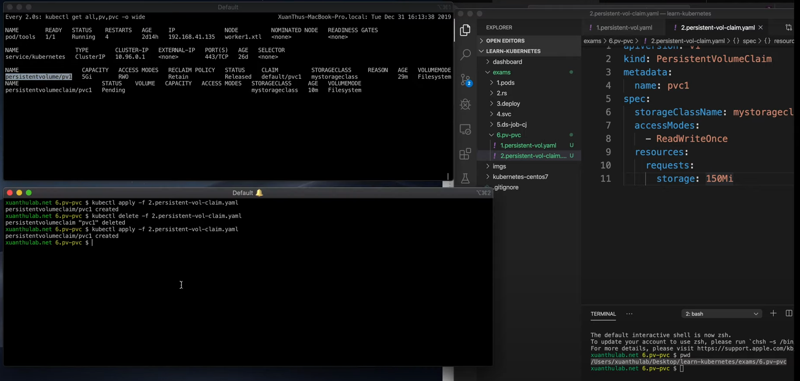
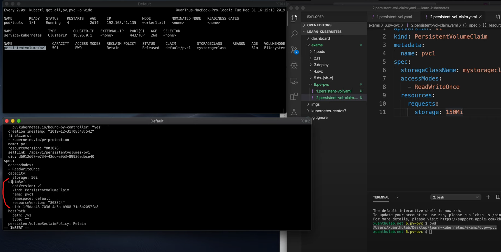

Tạo 1 ds "Persistent Volume/3.test.yaml" sử dụng pvc
kubectl apply -f 3.test.yaml
kubectl exec -it myapp-djnvs-358uhf sh

# Cài đặt NFS làm Server chia sẻ file (Kubernetes)
Sử dụng Volume để các POD cùng một dữ liệu, cần một loại đĩa mạng, ví dụ này sẽ thực hành dùng NFS. Ta sẽ cài đặt một Server NFS trực tiếp trên một Node của Kubernetes (độc lập, không chạy POD, nếu muốn bạn có thể cài trên một máy khác chuyên chia sẻ file).

Ta sẽ cài vào Node master (Node này là HDH CentOS 7), vậy hãy SSH vào và thực hiện:

Tham khảo: Cài NFS trên CentOS

yum install nfs-utils
systemctl enable rpcbind
systemctl enable nfs-server
systemctl enable nfs-lock
systemctl enable nfs-idmap
systemctl start rpcbind
systemctl start nfs-server
systemctl start nfs-lock
systemctl start nfs-idmap

Tạo (mở) file /etc/exports để soạn thảo, ở đây sẽ cấu hình để chia sẻ thư mục /data/mydata/
```bash
vi /etc/exports
/data/mydata  *(rw,sync,no_subtree_check,insecure)
```
Lưu thông lại, và thực hiện
```bash
# Tạo thư mục
mkdir -p /data/mydata
chmod -R 777 /data/mydata

# export và kiểm tra cấu hình chia sẻ
exportfs -rav
exportfs -v
showmount -e

# Khởi động lại và kiểm tra dịch vụ
systemctl stop nfs-server
systemctl start nfs-server
systemctl status nfs-server
```
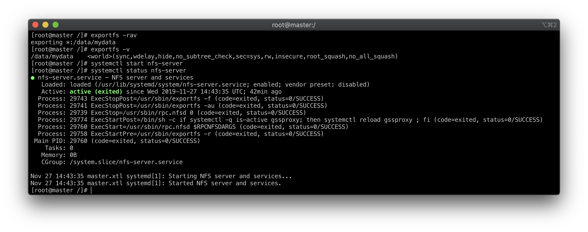

Server này có địa chỉ IP 172.16.10.100, giờ vào máy ở Node worker1.xtl (192.168.10.101) thực hiện mount thử ổ đĩa xem có hoạt động không.
```bash
ssh root@172.16.10.101
yum install nfs-utils
mkdir /home/data

# Gắn ổ đĩa
mount -t nfs 172.16.10.100:/data/mydata /home/data/

# Kiểm tra xong, hủy gắn ổ đĩa
umount /home/data
```
Như vậy đã có Server chia sẻ file NFS ở địa chỉ IP 192.168.10.100, đường dẫn chia sẻ file /data/data1

# Tạo PersistentVolume NFS
kubectl apply -f 1-pv-nfs.yaml
kubectl get pv -o wide
kubectl describe pv/pv1
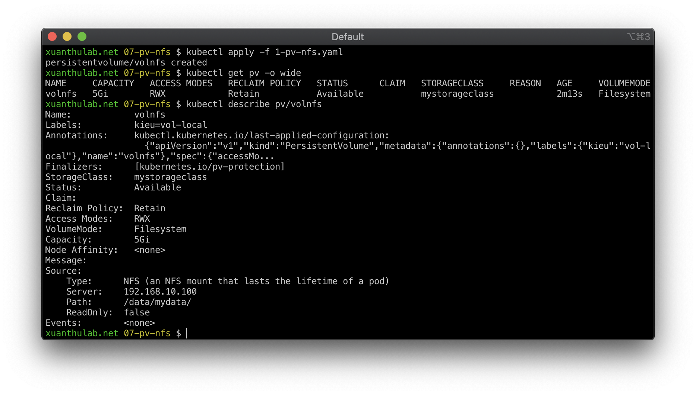

# Tạo PersistentVolumeClaim NFS
kubectl apply -f 2-pvc-nfs.yaml
kubectl get pvc,pv -o wide
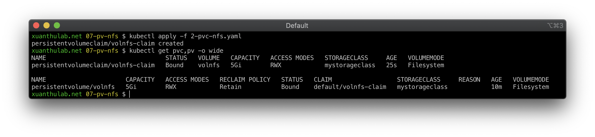

# Mount PersistentVolumeClaim NFS vào Container
Ta sẽ triển khai chạy máy chủ web từ image httpd.

SSH vào máy master, vào thư mục chia sẻ /data/mydata tạo một file index.html với nội dung đơn giản, ví dụ:

<h1>Apache is running ...</h1>
Tạo file triển khai, gồm có POD chạy http và dịch vụ kiểu NodePort, ánh xạ cổng host 31080 vào cổng 80 của POD

Sau khi triển khai, truy cập từ một IP của các node và cổng 31080
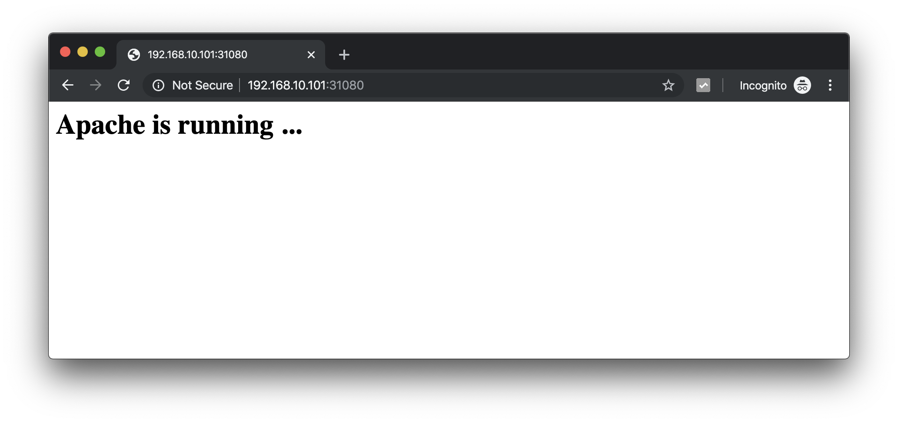
Ổ đĩa đã hoạt động chính xác, giờ bạn có thể scale, update dù POD ở đâu thì chúng vẫn truy cập một loại ổ đĩa (đọc, ghi)

# Ingress trong Kubernetes
Ingress là thành phần được dùng để điều hướng các yêu cầu traffic giao thức HTTP và HTTPS từ bên ngoài (interneet) vào các dịch vụ bên trong Cluster.

Ingress chỉ để phục vụ các cổng, yêu cầu HTTP, HTTPS còn các loại cổng khác, giao thức khác để truy cập được từ bên ngoài thì dùng Service với kiểu NodePort và LoadBalancer

Để Ingress hoặt động, hệ thồng cần một điều khiển ingress trước (Ingress controller), có nhiều loại để chọn sử dụng (tham khảo [Ingress Controller](https://kubernetes.io/docs/concepts/services-networking/ingress-controllers/#additional-controllers))
Nếu chọn Ngix Ingress Controller thì cài đặt theo: [NGINX Ingress Controller for Kubernetes](https://github.com/nginxinc/kubernetes-ingress).

Phần này, chọn loại HAProxy Ingress Controller - [HAProxy Ingress Controller](https://www.haproxy.com/documentation/hapee/1-9r1/traffic-management/kubernetes-ingress-controller/)


# Cài đặt HAProxy Ingress Controller
Ở đậy sử dụng bản custome là [HAProxy Ingress](https://haproxy-ingress.github.io/)
```bash
# Tạo namespace có tên ingress-controller
kubectl create ns ingress-controller
```

Triển khai các thành phần
```bash
kubectl apply -f https://haproxy-ingress.github.io/resources/haproxy-ingress.yaml
```

Thực hiện đánh nhãn các Node có thể chạy POD Ingress
```bash
# Gán thêm label cho các Node (ví dụ node worker2.xtl, worker1.xtl ...)
kubectl label node master.xtl role=ingress-controller
kubectl label node worker1.xtl role=ingress-controller
kubectl label node worker2.xtl role=ingress-controller
```
Kiểm tra các thành phần
kubectl get all -n ingress-controller
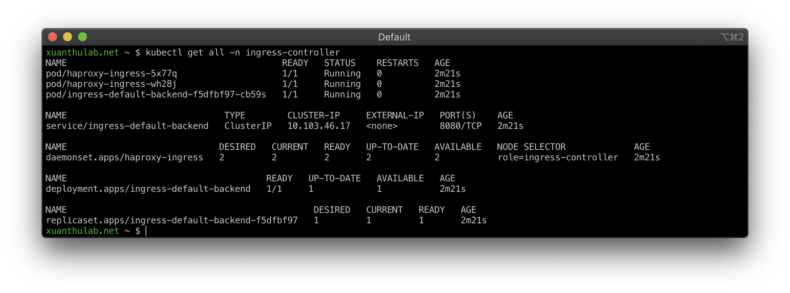

Giờ các tên miên, trỏ tới các IP của Node trong Cluster đã được điều khiển bởi Haproxy, ví dụ cấu hình một tên miền ảo (chính file /etc/hosts (Linux, macoS) hoặc C:\Windows\System32\Drivers\etc\hosts (Windows), thêm vào tên miền ảo, giả sử phanhoaithu.test trỏ tới IP của một NODE nào đó

172.16.10.102 phanhoaithu.test
Giờ truy cập địa chỉ http://phanhoaithu.test sẽ thấy
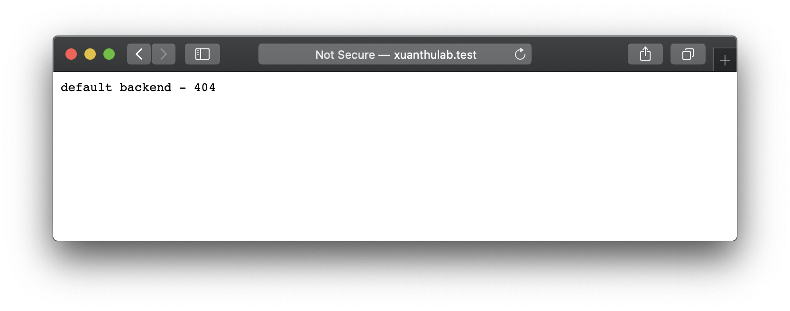
Vì tên miền xuanthulab.test chưa được cấu hình đến dịch vụ cụ thể nào, nó đã chuyển traffic do service/ingress-default-backend phục vụ.

# Tạo một Ingress
Triển khai một ứng dụng (http) ví dụ
kubectl apply -f 1.app-test.yaml

File trên triển khai một ứng dụng từ image nginx, trong đó có tạo một service với tên http-test-svc để tương tác với các POD tạo ra.
Giờ ta sẽ tạo một Ingress để điều hướng traffic (http, https) vào dịch vụ này.

# Tạo Ingress
kubectl apply -f 2.app-test-ingress.yaml
Giờ kiểm truy cập lại sẽ thấy:
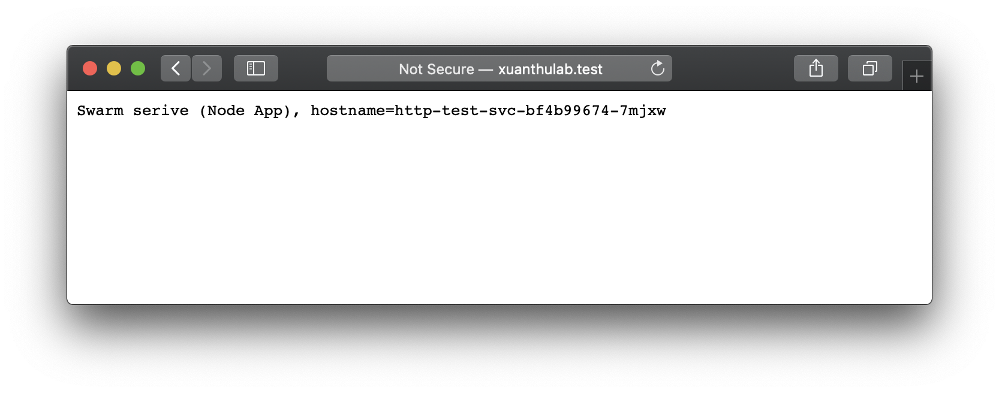

# Tạo một Ingress với cấu hình SSL
Để cấu hình truy cập an toàn SSL, cần có các xác thực - các cert bạn mua, hoặc đăng ký miễn phí với https://letsencrypt.org/ cho tên miền cụ thể của bạn. Tuy nhiên để thực hành, sẽ sinh cert với openssl (tự xác thực - bị cảnh báo bởi trình duyệt).

Chạy lệnh sau để sinh xác thực cho tên miền ảo xuanthulab.test:
openssl req -x509 -newkey rsa:2048 -nodes -days 365 -keyout privkey.pem -out fullchain.pem -subj '/CN=xuanthulab.test'

Sau đó tạo một Secret (thuộc namespace chạy POD), đặt tên Secret này là xuanthulab-test
kubectl create secret tls xuanthulab-test --cert=fullchain.pem --key=privkey.pem -n ingress-controller
kubectl get secret -n ingress-controller

Xóa đi Ingress cũ
kubectl delete -f 2.app-test-ingress.yaml
Tạo lại một Ingress có thiết lập xác thực SSL với cert trên:
kubectl apply -f 3.app-test-ingress-ssl.yaml
Giờ bạn đã có thể truy cập tới https://xuanthulab.test

# NGINX Kubernetes Ingress Controller 
là một ingress hỗ trợ khả năng căn bằng tải, SSL, URI rewrite ...

Ingress Controller được cung cấp bởi Nginx là một proxy nổi tiếng, mã nguồn của Nginx Ingress Controller trên github tại: [nginxinc/kubernetes-ingress](https://github.com/nginxinc/kubernetes-ingress)
Hướng dẫn cài đặt cơ bản trên Document của nó tại: [installation-with-manifests](https://docs.nginx.com/nginx-ingress-controller/installation/installation-with-manifests/)
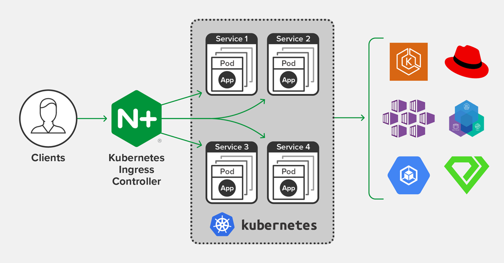

# Cài đặt NGINX Ingress Controller
Xóa ingress-controller đã cài ở bước trước: kubectl delete ns ingress-controller
Từ tài liệu hướng dẫn, sẽ triển khai Nginx Ingress Controller bằng cách triển khai các manifest (yaml) từ mã nguồn tại nginxinc/kubernetes-ingress:
```bash
git clone git@github.com:nginxinc/kubernetes-ingress.git
# vào thư mục tải về
cd kubernetes-ingress
cd deployments
```
Sau đó triển khai bằng các lệnh sau:

kubectl apply -f common/ns-and-sa.yaml
kubectl apply -f common/default-server-secret.yaml
kubectl apply -f common/nginx-config.yaml
kubectl apply -f rbac/rbac.yaml
kubectl apply -f daemon-set/nginx-ingress.yaml
Kiểm tra daemonset và các pod của Nginx Ingress Controller

kubectl get ds -n nginx-ingress
kubectl get po -n nginx-ingress
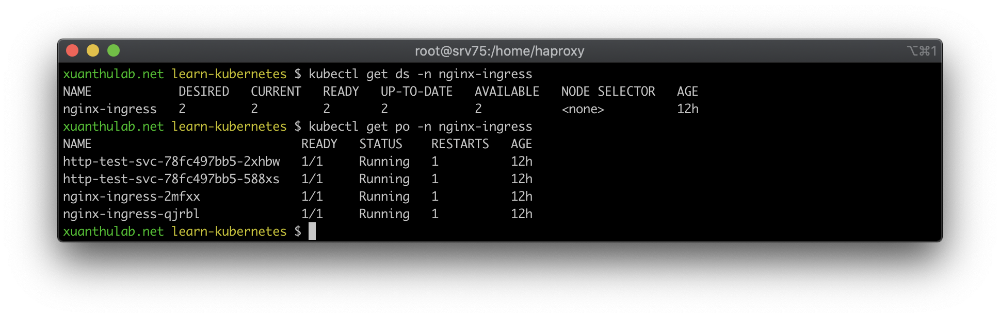

# Ví dụ tạo Ingress
Triển khai lại các vị dụ có trong phần Ví dụIngress Haproxy, nhưng chỉnh sửa lại một chút để dùng Nginx Ingress Controller
kubectl  apply -f 1.app-test.yaml
Tạo Ingress, chuyển hướng truy vấn vào ứng dụng trên khi truy cập bằng tên miền xuanthulab.test với giao thức http
kubectl apply -f 2.app-test-ingress.yaml

Hãy truy cập và kiểm tra từ trình duyệt đến địa chỉ http://xuanthulab.test

Triển khai SSL truy cập bằng https, ở đây sử dụng chính các xác thực lưu trong Secret có tên default-server-secret, đi kèm Nginx Ingress Controller (hoặc tự tạo theo ví dụ trước).

# Giới thiệu và cài đặt Rancher 2
Rancher 2.x là công cụ nguồn mở, giao diện nền web, để quản lý Kubernetes Cluster, triển khai ứng dụng trên Kubernetes cho dù Cluster của bạn chạy ở đâu, cung cấp bởi dịch vụ nào (AWS, GCP, Azure ...). Từ một Server cài đặt Rancher bạn có thể quản lý một hay nhiều Kubernetes Cluster trên cùng một giao diện.

Rancher 2.x cho phép bạn theo dõi, giám sát tình trạng của Kubernetes Cluster, nhận các cảnh bảo về sử dụng tài nguyên ...

Để triển khai Rancher, bạn cần cài đặt Rancher trên một Server: gọi là Server Rancher, cần đảm bảo địa chỉ IP của Server Rancher và các Node của Kubernetes Cluster cần quản lý liên lạc mạng được với nhau!

Để nhanh chóng, có thể triển khai Rancher từ một Docker Host. Ở đây sử dụng lại Kubernetes Cluster có 3 node từ các ví dụ trước và Rancher Server sẽ triển khai chạy trên Docker của máy ảo có địa chỉ IP 172.16.10.103

Triển khai Rancher: SSH vào máy 172.16.10.103 (CentOS 7, đã có docker) và thực hiện lệnh:

docker run -d --restart=unless-stopped \
    -p 80:80 -p 443:443 \
    rancher/rancher:latest
Trong trường hợp muốn lưu dữ liệu lâu dài, có thể mount ổ đĩa vào đường đường dẫn /var/lib/rancher

docker run -d --restart=unless-stopped \
    -p 80:80 -p 443:443 \
    -v /opt/rancher:/var/lib/rancher \
    rancher/rancher:latest
Sau khi triển khai, truy cập vào địa chỉ https://172.16.10.103, màn hình đầu tiên nó yêu cầu bạn thiết lập password có user admin
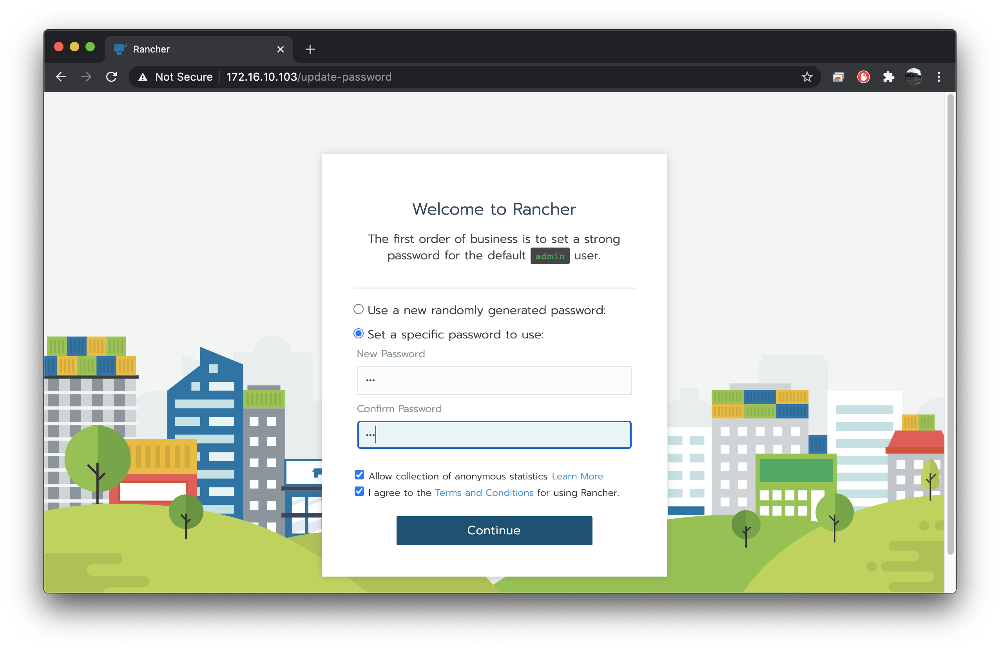
Sau khi thiết lập password, màn hình tiếp theo yêu cầu thiết lập địa chỉ URL của Server Rancher, bạn hãy điền bằng IP của máy HOST chạy Docker, ví dụ https://192.168.1.5:444 (sau này truy cập vào Rancher bằng địa chỉ này)
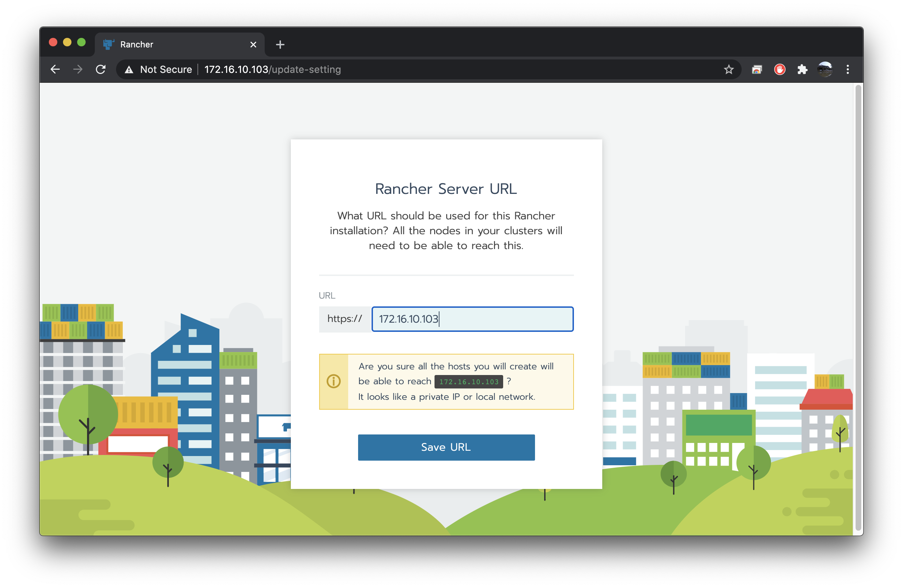
Cuối cùng giao diện có dạng sau:
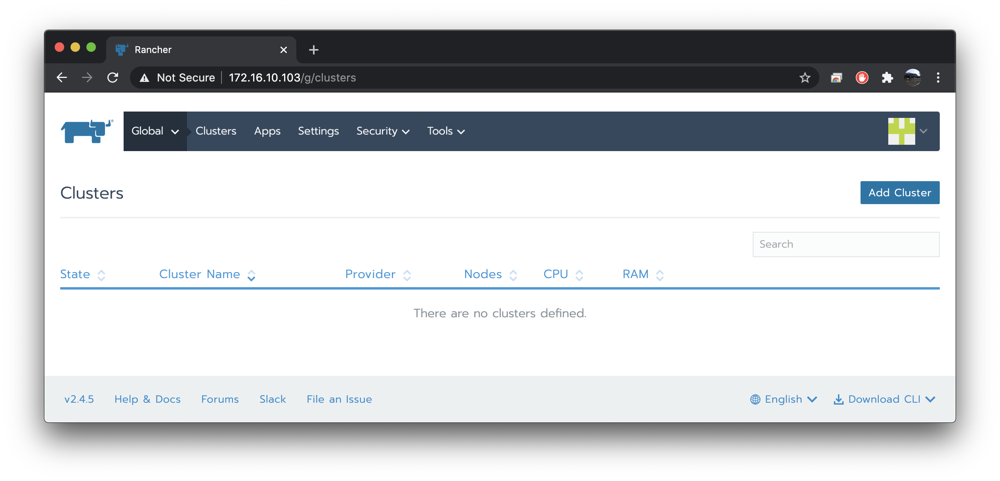

# Thêm Cluster cần quản lý vào Rancher 2

Trước khi thêm cần đảm bảo tất cả các node của Cluster đều có thể kết nối mạng được đến Server Rancher

Từ Rancher, chọn Clusters > Add Cluster, màn hình xuất hiện như dưới. Tùy thuộc vào Cluster triển khai từ dịch vụ nào thì chọn mục tương ứng, ví dụ Amazon EC2, Azure, GKE ..., với Cluster đã triển khai trên, sẽ chọn Import an existing cluster
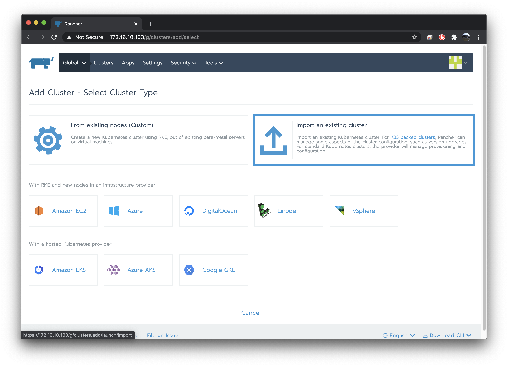
Cuối cùng là màn hình nó cung cấp các mã lệnh cần thực hiện tại Cluster bằng lệnh kubectl để kết nối.

ssh into flux pod to edit ssh known host (/etc/ssh/ssh_known_host)
kubectl exec -it flux-58c6c74ff6-dphfq -n flux bash

explore log of flux namespace
kubectl logs -f -l 'name=flux' -n flux --tail=200

kubectl get deploy -n monitoring prometheus-operator-kube-state-metrics -o yaml > prometheus-operator-kube-state-metrics.yaml

kubectl edit deploy -n monitoring prometheus-operator-kube-state-metrics -o yaml